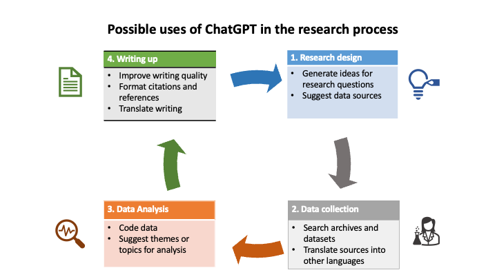

# ChatGPT and AI in Higher Education

{width=640}

(Image credit: [Google DeepMind](https://unsplash.com/photos/Uln4sEaUwGE), Unsplash)

## Teaching and learning

ChatGPT can improve teaching and learning processes by generating and assessing information, and can be used as a standalone tool or integrated into other systems. It can perform simple or technical tasks and examples show how it can augment teaching and learning.

| Role playing | Description | Example of implementation |
| :--  | :--         | :--     |
| **Possibility engine** | AI can suggest alternative ways to express an idea | Students can write queries in ChatGPT and use the "Regenerate" response function to explore alternative responses. |
| **Socratic opponent** | AI can act as an opponent to develop and argument | Students can enter prompts into ChatGPT, using the structure of a conversation or debate. Teachers can ask their students to use ChatGPT to prepare for discussions. |
| **Collaboration coach** | AI helps groups to research and solve problems together | When completing tasks and assignments, students can use ChatGPT to find information while working in groups. |
| **Guide on the side** | AI acts as a guide to navigate physical and conceptual spaces | Teachers use ChatGPT to generate content for their classes or courses, such as discussion questions, and to seek advice on how to support students in learning specific concepts. |
| **Personal tutor** | AI tutors each student and gives immediate feedback on progress | ChatGPT provides personalized feedback to students based on information provided by students or teachers (e.g., test scores). |
| **Co-designer** | AI assists throughout the design process | Teachers can seek ideas from ChatGPT for designing or updating a curriculum, including rubrics for assessment. Alternatively, they can focus on specific goals, such as making the curriculum more accessible. ChatGPT can provide recommendations and suggestions to help achieve these objectives. |
| **Exploratorium** | AI provides tools to play with, explore and interpret data | Teachers provide basic information to students who write different queries in ChatGPT to find out more. ChatGPT can be used to support language learning. |
| **Study buddy** | AI helps the student reflect on learning material | Students explain their current level of understanding to ChatGPT and ask for ways to help them study the material. ChatGPT could also be used to help students prepare for other tasks (e.g., job interviews).|
| **Motivator** | AI offers games and challenges to extend learning | Teachers or students ask ChatGPT for ideas about how to extend students’ learning after providing a summary of the current level of knowledge (e.g., quizzes, exercises). |
| **Dynamic assessment** | AI provides educators with a profile of each student’s current knowledge | Students engage in a tutorial-style dialogue with ChatGPT, and then request that ChatGPT create a summary of their current knowledge for sharing with their teacher or for assessment purposes. |

## Use of ChatGPT to support teachers

ChatGPT 3.5 is an AI chatbot that has been available since November 2022. It has the potential to revolutionize education systems, but it's also a threat. Some people have tried to ban ChatGPT in schools, while others believe it's the "silver bullet" solution to many education challenges around the world. The exact impact of the chatbot on the sector is unclear.

Skeptics say chatbots harm learning, but they disrupt traditional tools like essay writing. With a shortage of 69 million teachers worldwide, could ChatGPT supplement or replace them? The launch of ChatGPT shows potential to replace some human tasks. Are teachers an exception? Can chatbots complete tasks currently done by teachers? What are the risks? How can teachers use ChatGPT to improve their practice and efficiency?

## Opportunities of using ChatGPT as a learning tool

* **Enhance lessons**. In low- and middle-income countries, teachers face the challenge of making a dense curriculum engaging. To help with this, ChatGPT can translate learning objectives into lesson plans, offer ideas for class preparation, and aid in creating new assignments and assessments. However, ChatGPT does not assist with delivery, so teachers must still have strong teaching skills to ensure quality lessons.
* **Create assessment questions**. ChatGPT can help teachers improve assessment questions and generate multiple-choice items. It can also encourage higher-order thinking skills by providing prompts for essay questions and practical tasks. By using different types of assessment, teachers can help students develop critical thinking, problem-solving, and collaborative skills.
* **Support with language barriers**. The ideal scenario is for teachers to instruct in their native language, but some education systems are shifting towards teaching in a second language, such as English, even when evidence suggests the opposite approach. In such situations, teachers who are not proficient in English struggle to teach effectively. A proposed solution is the use of chatbots to enhance teachers' language proficiency, enabling them to teach better in both their native and a foreign language. Tools like Duolingo and GPT reportedly provide affordable, accessible, and highly personalized language lessons.
* **Provide additional support to students**. ChatGPT can be used by teachers to encourage student curiosity and generate ideas for homework assignments. AI tools are particularly helpful in identifying the source information used in the chats. However, there is a risk that students may ask the chat to complete their homework for them instead of seeking help. To address this risk and teach about integrity, teachers can discuss the limitations of these tools, such as privacy risks, bias, and hallucination. Furthermore, teachers should focus on questions that cannot be answered by ChatGPT, such as those that require knowledge outside of the chatbot's training data, such as human emotions or subjective perspectives.
* **Grading assessment and papers**. ChatGPT can be used to automatically grade multiple-choice/one-answer tests; it can also help teachers with standards-based grading.  This has potential unintended consequences for low accuracy, poor grading or false positive proctoring (mistakenly red flagging students for cheating). When considering systems for proctoring or grading, it is critical to take measures to secure fairness, accountability, confidentiality, and transparency of their algorithms whenever needed.

## Research

ChatGPT can be used by researchers at different stages of the research process.

{width=900}

(Image by author)

## Challenges and ethical implications

ChatGPT has had an immediate and divisive impact on higher education. While it has many applications, some universities have banned it due to concerns about student plagiarism, and some countries have blocked it. This section outlines the main challenges and ethical implications of ChatGPT in higher education.

### Academic integrity

Higher education institutions (HEIs) and educators have raised concerns about ChatGPT's impact on academic integrity. They worry that students using ChatGPT to prepare or write essays and exams may lead to increased plagiarism and cheating, particularly in subjects that rely heavily on written inputs or information recall.

Detecting plagiarism from writing generated by ChatGPT is also difficult, leading to the development of new applications to identify if AI has been used. As a result, multiple HEIs around the world have banned ChatGPT, and others have modified their assessment methods to include in-class or non-written assignments.

### Lack of regulation

ChatGPT lacks regulation, a concern addressed in the UNESCO Recommendation on the Ethics of AI. Over 1,000 academics and private sector leaders have called for a pause on the development of powerful AI systems in an open letter. This would allow time for investigating potential risks, understanding them better, and developing shared protocols.

### Privacy concerns

In April 2023, Italy blocked ChatGPT due to privacy concerns. The country's data protection authority found the collection and storage of personal data used to train ChatGPT lacked a legal basis. The authority also raised ethical concerns about the tool's inability to determine a user's age, which could expose minors to age-inappropriate responses. This example shows the broader issue of data collection, its use in AI, and who is responsible for it.

### Cognitive bias

Note that ChatGPT is not guided by ethical principles and cannot distinguish between truth and falsehood. It collects information from online databases and texts, and may also learn any cognitive biases found in that information. It is therefore important to critically analyze its results and compare them with other sources of information.

### Gender and diversity

Gender and other discrimination issues in AI are not limited to ChatGPT alone, but rather apply to all forms of AI. This is due to the low participation of women in AI-related fields and research, as well as the ability of generative AI to create and spread content that reinforces stereotypes and discriminates against certain groups.

### Accesibility

Two major concerns exist regarding ChatGPT's accessibility: limited availability due to government regulations, censorship, or other internet restrictions in some countries, and broader issues of access and equity stemming from disparities in internet availability, cost, and speed. Similarly, AI research and development have not been equally dispersed worldwide, with certain regions lacking the knowledge or resources to explore the topic as thoroughly.

### Commercialization

ChatGPT, created by OpenAI, has a free version. However, the company also offers a subscription option that provides faster access to new versions of the tool. With private entities being involved in higher education, caution and regulation are necessary when selecting AI and other tools that are not open source and may extract data for commercial gain.

## 5 takeways for policymakers

Policymakers should focus on utilizing ChatGPT effectively instead of banning it or prohibiting internet use, in order to prepare students for a changing landscape in education.

At a minimum, policymakers should adhere to these ground rules if they plan to incorporate ChatGPT in their education system.

1. **Gathering information**: Policymakers should assess the current usage of ChatGPT by teachers and students before deciding on policies that may affect its use. In addition, teachers should be involved in deciding how ChatGPT will be used.
1. **Digital Skills**: Policymakers must ensure all users have a basic understanding of "algorithmic awareness" to recognize misinformation and other ethical issues. For instance, teachers need explicit training to use this technology.
1. **Raise awareness**: Policymakers should share information about the limitations of this technology, including inherent biases, underrepresented countries and languages. They should emphasize the lack of evidence available as to its usefulness for learning as part of trainings for all users.
1. **Hold tech providers accountable**: Policymakers should regulate the providers of emerging tech like ChatGPT, which has unknown implications on teaching and learning. Regulation is necessary to prevent misuse and ensure that the tech is advantageous for learning.

* **Teacher supervision is crucial**: When using ChatGPT, especially with children, teachers must be involved in teaching and learning to ensure responsible and safe use of technology.

Given the current and future teacher shortages, policymakers may consider using chatbots to replace human teachers or tutors. While these chatbots can support teachers, policymakers should be cautious. More research is needed to understand how chatbots can be used to improve teaching and learning.

## References

* [Google. (2023)](https://bard.google.com/). Bard (May 23 version), Large Language Model.
* [OpenAI. (2023)](https://chat.openai.com/?model=gpt-4). ChatGPT (May 24 version), Large language model.
* [Notion AI (2023)](https://www.notion.so/blog/introducing-notion-ai). AI workspace.
* [ChatGPT and Artificial Intelligence in Higher Education. A Quick Start](https://www.iesalc.unesco.org/wp-content/uploads/2023/04/ChatGPT-and-Artificial-Intelligence-in-higher-education-Quick-Start-guide_EN_FINAL.pdf). Emma Sabzalieva and Arianna Valentini, UNESCO. April, 2023.
* [How to use ChatGPT to support teachers: The good, the bad, and the ugly](https://blogs.worldbank.org/education/how-use-chatgpt-support-teachers-good-bad-and-ugly?cid=edu_tt_education_en_ext). Tracy Wilichowsky and Cristóbal Cobo. World Bank Blogs. May 02, 2023.

***

Created: 05/28/2023 (C. Lizárraga);
Last update: 05/30/2023 (C. Lizárraga)

{width=128}

[CC BY-NC-SA 4.0](https://creativecommons.org/licenses/by-nc-sa/4.0/)

{width="256"}
