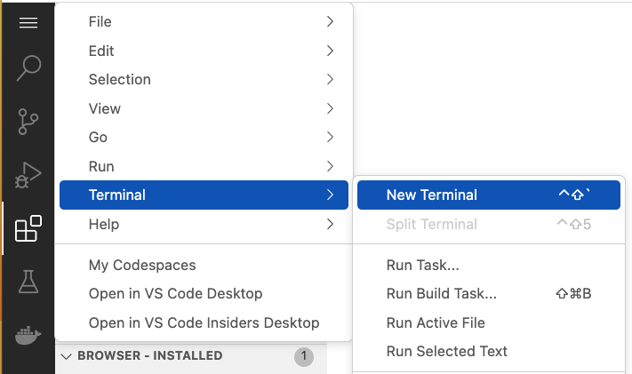
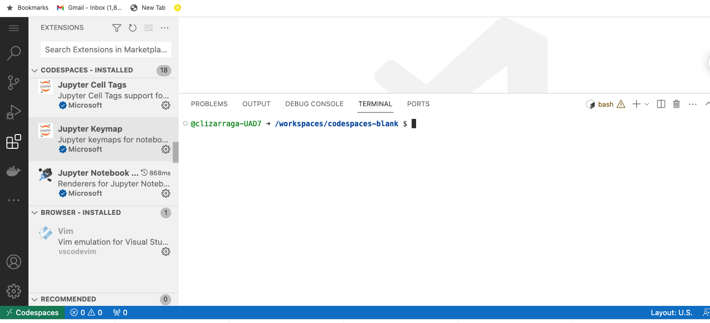

# Unix Shell and Unix Filesystem

### Unix and Unix-like operating systems

For clarity, [Unix](https://en.wikipedia.org/wiki/Unix) is a family of [multitasking](https://en.wikipedia.org/wiki/Computer_multitasking), [multi-user](https://en.wikipedia.org/wiki/Multi-user_software) computer operating system. There is a [large family of Unix-like](https://en.wikipedia.org/wiki/Unix-like) operating systems.

Some well-known cases of Unix-like operating systems are [Linux](https://en.wikipedia.org/wiki/Linux) and [BSD](https://en.wikipedia.org/wiki/Berkeley_Software_Distribution).

### Sessions in UNIX/Linux

To work in a terminal, we need to have a valid _username_, in order to begin a session via the `login` command.

If using _VSCode_ we can launch a new terminal from the "Hamburguer Menu" as shown in the next figure



The new terminal will open in the lower right part of the _VSCode interface_.



The terminal is ready for user input.

:memo: To end the session enter the `exit` command. It will finish the session and close the terminal.

### The Command Shell or Command Line Interpreter

In the background a _Command shell_ is running. To find out which shell is active we can type the following command after the _system prompt_ `$`.

```
echo $SHELL
```

which will return the command shell program, [`/bin/bash`](https://en.wikipedia.org/wiki/Bash_(Unix_shell)), in the _Codespaces_ terminal. This is _Bash_ (Bourne Again Shell), which is derived from the original shell [`/bin/sh`](https://en.wikipedia.org/wiki/Bourne_shell). In other system environments, maybe you will encounter [other similar shells](https://en.wikipedia.org/wiki/Comparison_of_command_shells) ([`/bin/csh`](https://en.wikipedia.org/wiki/C_shell), [`/bin/tcsh`](https://en.wikipedia.org/wiki/Tcsh), [`/bin/ksh`](https://en.wikipedia.org/wiki/KornShell), [`/bin/zsh`](https://en.wikipedia.org/wiki/Z_shell), and others).

The command shell serves as an intermediary between the user and the [Operating System Kernel](https://en.wikipedia.org/wiki/Kernel_(operating_system)), which controls all the available computer resources.

<p></p>

#### [Read more on the Unix Shell](https://github.com/clizarraga-UAD7/Workshops/wiki/The-Command-Line-Interface-Shell)

### Files and Directories

The [Unix filesystem](https://en.wikipedia.org/wiki/Unix_filesystem) is considered as the central component of the operating system. The filesystem provides storage and retrieval for other programs to read them. The filesystem also provides access to other resources, for example the [device files](https://en.wikipedia.org/wiki/Device_file), [terminals](https://en.wikipedia.org/wiki/Computer_terminal), [printers](https://en.wikipedia.org/wiki/Printer_(computing)), [computer mice](https://en.wikipedia.org/wiki/Computer_mouse), and many other.

| Directory or file | Description |
| :--: | :--- |
| `/` | The _root_ directory is the top-level directory in the Unix file system. |
| `/bin` | The _bin_ directory contains executable programs. |
| `/dev` |  The _dev_ directory contains device files. |
| `/lib` | The _lib_ directory contains libraries. |
| `man` | The _man_ directory contains manual pages.  |
| `/etc` |  The _etc_ directory contains configuration files. |
| `/home` | The _home_ directory is the default directory for each user. |
| `/tmp` | The _tmp_ directory is a temporary directory where files can be created and deleted without affecting the rest of the file system. |
| `/usr` | The _usr_ directory contains system files that are shared by all users. |
| `/var` | The var directory contains files that can vary in size, such as log files and mail files. |

The Unix file system is a _hierarchical structure_, with each directory containing a set of files and subdirectories. The _root_ directory is the top-level directory, and all other directories are below it.

<p></p>

([See a larger image](https://upload.wikimedia.org/wikipedia/commons/thumb/f/f3/Standard-unix-filesystem-hierarchy.svg/2560px-Standard-unix-filesystem-hierarchy.svg.png))

### First steps: Manual pages and getting help

In general, almost all Unix systems include their manual pages of system commands.

| Commands | Description |
| :--: | :--- |
| [`man command`](https://man7.org/linux/man-pages/man1/man.1.html) | Online manual pages |
| [`apropos keyword`](https://man7.org/linux/man-pages/man1/apropos.1.html) | Searches keyword in manual pages |
| `command --help` | Show how to use command |
| [`more filename`](https://man7.org/linux/man-pages/man1/more.1.html) | Show contents of a text file |
| [`less filename`](https://man7.org/linux/man-pages/man1/less.1.html) | Show content of a text file |  

The [`more`](https://man7.org/linux/man-pages/man1/more.1.html) and [`less`](https://man7.org/linux/man-pages/man1/less.1.html) commands show the contents of a file. The following commands control the flow of information.

| Command | Action in `less` / `more` |
| :--: | :--- |
| `d` or `Space bar` | page down |
| `u`         | page up (less) |
| `p` | beginning of file |
| `G` | End of file |
| `q` | Quit and exit |  

#### ls: Listing files in directories

The [`ls` command](https://man7.org/linux/man-pages/man1/ls.1.html), lists all the contents of a directory.

For example `ls -al` will list  all files in a directory in long format, including hidden files (those files whose name starts with a dot `.`)

Try `ls --help` to show you all the available options of the command.

The command `ls -al */*` shows all the contents of a directory and subdirectories next level down.

#### pwd: Prints present/working directory

The [`pwd` command](https://www.man7.org/linux/man-pages/man1/pwd.1.html), will show the current position in the directory structure.

#### cd: Change the working directory

The [`cd` command](https://man7.org/linux/man-pages/man1/cd.1p.html), will help you navigate in the directory structure.

Common commands

| Command | Action |
| :--: | :-- |
| `cd` | A blank option takes you to your `HOME` directory |
| `cd ~` | Same as above, takes you to your `HOME` directory (where `~` is aka _tilde_) |
| `cd ..` | Moves you up, to the parent directory |
| `cd ../..` | Moves you up two levels |
| `cd -` | Moves you to the previous working directory |

#### See more [Unix Shell Commands here](https://github.com/clizarraga-UAD7/Workshops/wiki/The-Command-Line-Interface-Shell#unix-shell)

### Main References

* [The Command Line Interface Shell](https://github.com/clizarraga-UAD7/Workshops/wiki/The-Command-Line-Interface-Shell)
* [Introducing the Shell](https://swcarpentry.github.io/shell-novice/01-intro.html)
* [Navigating Files and Directories](https://swcarpentry.github.io/shell-novice/02-filedir.html)
* [explainshell.com](https://explainshell.com/)
