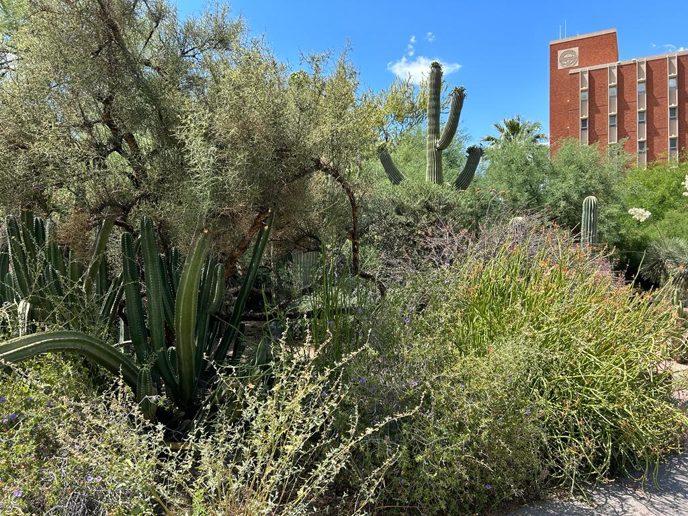

# Welcome to the UA Data Science Training

**(This site: `https://workshops-uad7.github.io/`)**

{:width="800px"}

(Credit: Photo by author. University of Arizona, Tucson, AZ.)

***

## Available training materials

### Command Line Interface

* [Command Line Interface - Unix Shell](https://workshops-uad7.github.io/CommandLineInterface/)
* [The Command Line Interface Shell](https://github.com/clizarraga-UAD7/Workshops/wiki/The-Command-Line-Interface-Shell)
* [UNIX Shell Command Line Programming](https://github.com/clizarraga-UAD7/Workshops/wiki/UNIX-Shell---Command-Line-Programming)

### Git & Github

* [Introduction to Github](https://github.com/clizarraga-UAD7/Workshops/wiki/Introduction-to-Github)
* [Introduction to Github Wikis](https://github.com/ua-data7/Trainings/wiki/Introduction-to-Github-Wikis)
* [Github Wikis and Github Pages](https://github.com/clizarraga-UAD7/Workshops/wiki/Github-Wikis-and-Github-Pages)

### Working in Data Science with Python

* [Python for Data Science](https://github.com/clizarraga-UAD7/Workshops/wiki)
* [Machine Learning Algorithms](https://github.com/clizarraga-UAD7/MLWorkshops/wiki)
* [Data Science in Bioinformatics](https://github.com/clizarraga-UAD7/Bioinformatics/wiki)
* [Data Science in Earth Sciences](https://github.com/clizarraga-UAD7/geo-datascience2)

### AI Tools / Prompt Engineering

* [AI Tools Landscape](https://github.com/ua-data7/LearningResources/wiki/AI-Tools-Landscape)
* [GPT 101](https://ua-data7.github.io/introllms/)
  

### General Open Science and Data Science Learning Resources

* [A Data Science Resources Library](https://github.com/ua-data7/LearningResources/wiki)
* [FOSS - Foundational Open Science Skills](https://foss.cyverse.org). CyVerse, University of Arizona.

***

Created: 05/11/2023;  Last update: 08/16/2023

Carlos Lizárraga-Celaya. [Data Lab](https://github.com/clizarraga-UAD7/DataScienceLab/wiki), Data Science Institute, University of Arizona.

{:width="200px"} \  [CC BY-NC-SA 4.0](https://creativecommons.org/licenses/by-nc-sa/4.0/)

[{:width="400px"}](https://datascience.arizona.edu)
