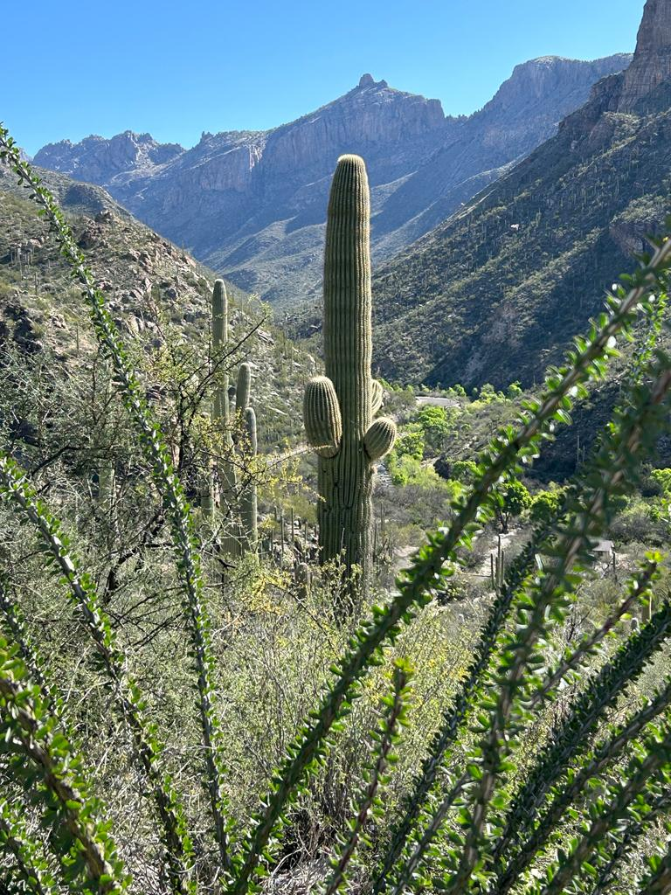

# Welcome to the UA Data Science Trainings

:construction: :construction: :construction: :construction: :construction: :construction:  :construction:  :construction:  :construction: :construction: :construction: :construction: 

***

Available training materials:

* [Command Line Interface - Unix Shell](https://workshops-uad7.github.io/CommandLineInterface/)

***

Created: 05/11/2023;  Last update: 05/16/2023 
Carlos Lizárraga 
Data Science Institute 
University of Arizona

 \  [CC BY-NC-SA 4.0](https://creativecommons.org/licenses/by-nc-sa/4.0/)

